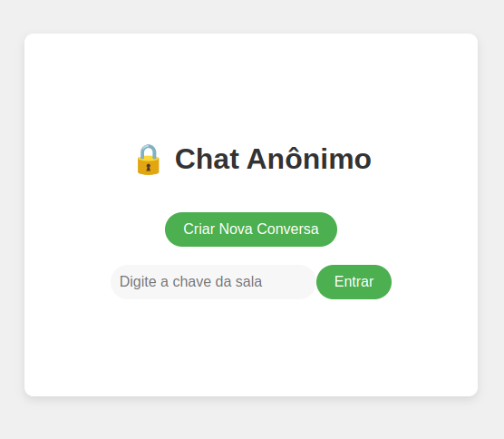
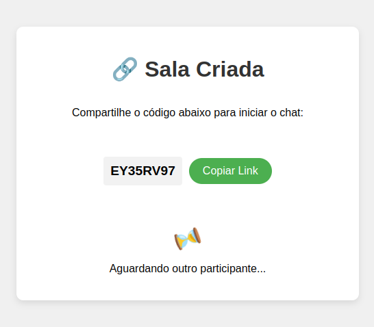
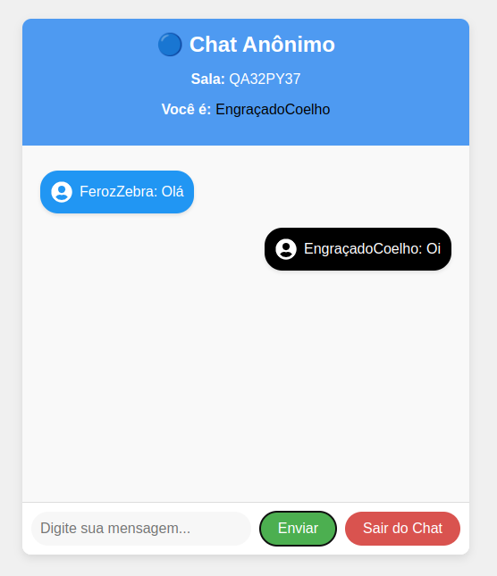
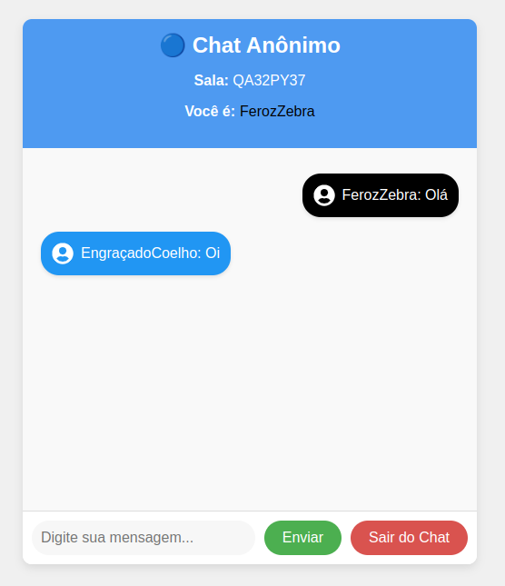

# 🗨️ Realtime Chat Application

## 📌 Description
**Realtime-Chat** is a real-time anonymous chat application that lets you create secure, private rooms. It uses **WebSockets** for real-time messaging and is powered by:
- **Backend**: FastAPI (Python)
- **Frontend**: React
- **In-memory store**: Redis
- **Containerization**: Docker
- **Orchestration**: Kubernetes


## 🚀 Features
- **Anonymous Chat Room Creation** – Generate a room code and share it to start a private conversation.  
- **Real-Time Messaging** – Built with WebSockets for instant communication.  
- **Auto Reconnection** – Automatically reconnects if the WebSocket connection drops.  
- **Responsive UI** – Works seamlessly on desktop and mobile.  
- **Scalable** – Leverages Docker and Kubernetes for horizontal scalability. 


## 🛠️ Technologies Used
### 🔹 Backend:
- **[FastAPI](https://fastapi.tiangolo.com/)** – Lightweight, fast, and asynchronous API.  
- **WebSockets** – Real-time communication.  
- **Redis** – Manages state and WebSocket connections.  

### 🔹 Frontend:
- **[React](https://reactjs.org/)** – Interactive and reactive UI.  
- **Nginx** – Web server to serve the frontend.  

### 🔹 DevOps:
- **Docker** – Containerization.  
- **Kubernetes** – Container orchestration.  
- **GitHub Actions** – Automated CI/CD pipeline.  


## 🏗️ Installation and Running Locally
### Prerequisites:
- Docker  
- Node.js (v18+)  
- Python 3.10+  

### 1. Running without Docker (simple local development)

#### 1.1 Clone the repository
```bash
git clone https://github.com/your-username/realtime-chat.git
cd realtime-chat
```

#### 1.2 Backend (FastAPI)
```bash
cd backend
python -m venv venv
source venv/bin/activate  # Linux/Mac
# venv\Scripts\activate   # Windows

pip install -r requirements.txt
uvicorn main:app --reload --port 8000
```
The backend will be available at `http://localhost:8000`.

#### 1.3 Frontend (React)
```bash
cd frontend/chat-frontend
npm install
npm start
```
The frontend will be available at `http://localhost:3000`.

    Note: In pure local development mode (no Kubernetes), ensure the frontend’s WebSocket URL is set to `ws://localhost:8000` (or use a proxy). If you’re using NodePort in Minikube, please refer to the Kubernetes section below.

### 2. Running with Docker Compose 🐳
```bash
docker-compose up --build
```
- **Frontend**: `http://localhost:3000`
- **Backend (API)**: `http://localhost:8000`
This is another straightforward approach for local development without Kubernetes.

### ☸️ Kubernetes Deployment (Minikube)

#### 2.1. Prepare the cluster
  1. Install **Minikube** and **kubectl**.
  2. Start Minikube:
  ```bash
  minikube start
  ```

#### 2.2. Build and push Docker images
Use the following commands (or a script) to build and push your Docker images to Docker Hub:
```bash
# Example using version "2.0" — increment as needed
docker build -t dvgirotto/my-anonymous-chat-backend:2.0 ./backend
docker push dvgirotto/my-anonymous-chat-backend:2.0

docker build -t dvgirotto/my-anonymous-chat-frontend:2.0 ./frontend
docker push dvgirotto/my-anonymous-chat-frontend:2.0
```

#### 2.3. Apply the Kubernetes manifests
Inside the `k8s/` directory, apply the YAML files:
```bash
kubectl apply -f k8s/
```
- This will create:
  **backend-deployment** and **backend-service** (NodePort)
  **frontend-deployment** and **frontend-service** (LoadBalancer or NodePort)
  **redis-deployment** and **redis-service** (ClusterIP)

#### 2.4. Update the image version in Kubernetes
Point your Deployment to the new tags (e.g., 2.0):
```bash
kubectl set image deployment/backend-deployment \
  backend=dvgirotto/my-anonymous-chat-backend:2.0

kubectl set image deployment/frontend-deployment \
  frontend=dvgirotto/my-anonymous-chat-frontend:2.0

# Watch the rollout status
kubectl rollout status deployment/backend-deployment
kubectl rollout status deployment/frontend-deployment
```

#### 2.5. Check the services and access the frontend
Run:
```bash
minikube service frontend-service --url
```
Example output:
```bash
http://192.168.49.2:32000
```
Open `http://192.168.49.2:32000` in your browser.

### 🔄 CI/CD (Automated with GitHub Actions)
The CI/CD pipeline is configured in `.github/workflows/ci-cd.yaml` to:
  - Build and Push Docker images (frontend/backend) to Docker Hub.
  - Automatic Deployment to Kubernetes after merging to the `main` branch (optional, if you have the appropriate credentials set up).

## 🖼️ Screenshots
<div align="center">
  <h3>🔑 Welcome Screen</h3>
  
  
  <h3>⏳ Waiting Room</h3>
  

  <h3>💬 Chat Room</h3>
  
  
</div>


## 🤝 Contributing

1. Fork this repository.
2. Create a new branch: `git checkout -b feature/new-feature`
3. Commit your changes: `git commit -m "feat: add new feature"`
4. Push to the branch: `git push origin feature/new-feature`
5. Open a Pull Request.

## 📄 License

This project is licensed under the MIT License. Feel free to modify and use it!